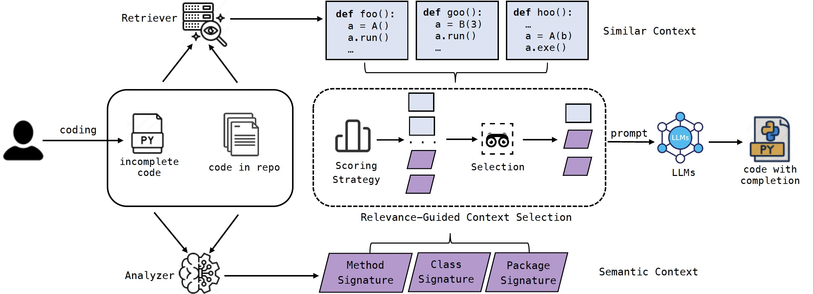

# RepoFuse: Repository-Level Code Completion with Language Models with Fused Dual Context

## Overview

RepoFuse is a pioneering solution designed to enhance repository-level code completion without the latency trade-off.
RepoFuse uniquely fuses two types of context: the analogy context, rooted in code analogies, and the rationale context,
which encompasses in-depth semantic relationships. We propose a novel rank truncated generation (RTG) technique that
efficiently condenses these contexts into prompts with restricted size. This enables RepoFuse to deliver precise code
completions while maintaining inference efficiency. Our evaluations using the CrossCodeEval suite reveal that RepoFuse
outperforms common open-source methods, achieving an average improvement of 3.97 in code exact match score for the
Python dataset and 3.01 for the Java dataset compared to state-of-the-art baseline methods.
Beyond experimental validation, RepoFuse has been integrated into the workflow of a large enterprise, leading to an 18%
improvement in acceptance rate during an online experiment.


**Figure: The workflow of RepoFuse**

### Repo-specific semantic graph

The Repo-specific semantic graph is a tool that can construct the dependency relationships between entities in the code
and store this
information in the form of a multi-directed graph. We use this graph to construct the context for code
completion.

See [repo_specific_semantic_graph/README.md](repo_specific_semantic_graph/README.md) for details.

## Data Generation

### Construct CrossCodeEval line completion data retrieved from Repo-specific semantic graph context

1. Follow instructions
   on [repo_specific_semantic_graph/README.md#install](repo_specific_semantic_graph/README.md#install) to install the
   Repo-specific semantic graph Python package.
2. Install the rest of the dependencies that the script depend on: `pip install -r retrieval/requirements.txt`
3. Download the CrossCodeEval dataset and the raw data from <https://github.com/amazon-science/cceval>
4. Run `retrieval/construct_cceval_data.py` to construct the Repo-Specific Semantic Graph context data. You can
   run `python retrieval/construct_cceval_data.py -h` for help on the arguments. For example:

   ```shell
   python retrieval/construct_cceval_data.py -d <path/to/CrossCodeEval>/crosscodeeval_data/python/line_completion_oracle_bm25.jsonl -o <path/to/output_dir>/line_completion_dependency_graph.jsonl -r <path/to/CrossCodeEval>/crosscodeeval_rawdata -j 10 -l python
   ```

## Evaluate

After data generation by codegraph, you can start your evaluation by the following step:

1. run `cd eval && pip install -r requirements.txt` to install evaluation environment.
2. You need to modify the configuration in `eval.sh`, specifically including the following:

+ model_name_or_path:Replace {YOUR_MODEL_PATH} with the path to your model.

+ prompt_file:Replace {YOUR_PROMPT_FILE} with the path to your prompt file.

+ cfc_seq_length_list:Adjust the list of lengths for the crossfile content prompt as needed. You can pass in multiple
  values at once, separated by commas.

+ crossfile_type:The type of crossfile content you use. You can choose from Similar, Related and S_R. You can pass in
  multiple values at once, separated by commas.

+ ranking_strategy_list:Specify the ranking strategies to use. You can choose from UnixCoder, Random, CodeBert, Jaccard,
  Edit, BM25, InDegree, and Es_Orcal.

+ lang:Set the test language. Supported languages are python, java, csharp, and typescript.

3. Run `bash eval.sh`

## Contributing

Contributions are welcome! If you have any suggestions, ideas, bug reports, or new model/feature supported, please open
an issue or submit a pull request.

## Citation

If you find our work useful or helpful for your R&D works, please feel free to cite our paper as below.

```
@misc{liang2024repofuserepositorylevelcodecompletion,
      title={RepoFuse: Repository-Level Code Completion with Fused Dual Context}, 
      author={Ming Liang and Xiaoheng Xie and Gehao Zhang and Xunjin Zheng and Peng Di and wei jiang and Hongwei Chen and Chengpeng Wang and Gang Fan},
      year={2024},
      eprint={2402.14323},
      archivePrefix={arXiv},
      primaryClass={cs.SE},
      url={https://arxiv.org/abs/2402.14323}, 
}
```
